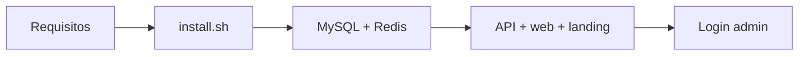

DashCole es el dashboard escolar para administrar calificaciones, estudiantes, cursos, finanzas y RRHH. Esta guía deja una instalación local lista para iniciar sesión.



## Requisitos

Necesitas:

- Node.js 20 o superior y npm
- Docker con Compose
- Acceso a la raíz del repositorio DashCole

Opcional en desarrollo: `pdftotext` si vas a correr pruebas de integración de PDF.

## Instalar dependencias

Desde la raíz del proyecto:

```bash
./etc/scripts/install.sh
```

El script:

1. Valida Node, npm y Docker.
2. Crea `.env` desde `.env.example` solo si aún no existe.
3. Instala paquetes de `api`, `web` y `landing`.
4. Descarga las imágenes de MySQL y Redis.

No sobrescribe un `.env` ya existente. Ajusta puertos o credenciales ahí antes del primer arranque si hace falta.

## Arrancar el entorno

```bash
./etc/scripts/run.sh
```

`run.sh` es un alias de `./etc/scripts/x2`: levanta MySQL/Redis, espera healthchecks y ejecuta API, dashboard y landing en modo desarrollo.

URLs habituales:

| Servicio | URL |
| --- | --- |
| Landing | http://localhost:5173 |
| Dashboard | http://localhost:5174 |
| API health | http://localhost:PORT/api/health |

`PORT` viene del `.env` (en el ejemplo local suele ser `6666`).

## Primer acceso

En la primera ejecución normal se crean tablas, el colegio base y cuentas iniciales (contraseña `admin`):

- Director: `admin@hlquery.com`
- Demo: `demo@hlquery.com`
- Plataforma: `super@hlquery.com`

Cambia la contraseña desde **Mi cuenta** después del primer ingreso.

## Conexión MySQL local

Por defecto los contenedores publican MySQL en el puerto host `3307` y Redis en `6380` para no chocar con servicios locales. La base sembrada usa:

```text
host: localhost
puerto: el de MYSQL_PORT en .env (p. ej. 3307)
base: colegio
usuario: colegio
contraseña: colegio
```

## Detener

Detén los procesos de desarrollo con Ctrl+C. Para bajar la infraestructura:

```bash
docker compose down
```

Los volúmenes Docker conservan los datos. Para un reinicio limpio usa la guía de [x2, x3 y x4](/installation/entorno-local-x2-x3-x4).

## Siguiente paso

- [Entorno local con x2, x3 y x4](/installation/entorno-local-x2-x3-x4)
- [Configurar el archivo .env](/installation/configurar-entorno)
- [Cuentas, roles y permisos](/administration/cuentas-roles-y-permisos)
